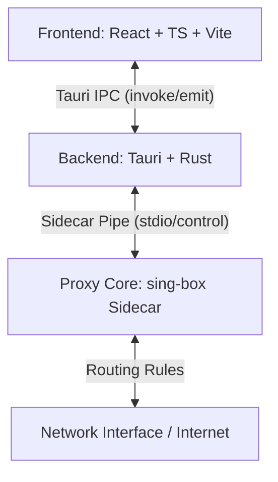

# X-Link Core Developer Architecture & Networking Documentation

This document provides a comprehensive technical overview of the X-Link application architecture, connection lifecycle management, advanced routing mechanisms, and DNS configurations designed to prevent deadlocks and optimize performance on Windows.

---

## 1. High-Level System Architecture

X-Link is built on a decoupled three-tier architecture:



* **Frontend (React + Vite + TypeScript):** Handles user interactions, manages state for profiles/settings, displays real-time connection status/uptime, and streams bandwidth traffic charts.
* **Backend (Tauri + Rust):** Acts as the supervisor. It bypasses CORS to fetch subscription profiles, validates generated configurations using the sing-box check validator, monitors system tray events, triggers UAC admin elevation gates for TUN mode, and monitors process health.
* **Core Engine (sing-box sidecar):** Spawns as a background sidecar process. It handles tunneling (VLESS, VMess, Trojan, Shadowsocks) and implements the active routing rules.

---

## 2. Profile Parsing & Configuration Adapters

When subscriptions are imported via URL, local file, or clipboard, X-Link executes a unified format dispatcher engine to translate them into native sing-box configurations:

```
Subscription Raw Bytes
       │
       ▼
[Strip Whitespace / Newlines] ──► Try Base64 Decode ──► Success? (Base64 Sub)
       │                                                    │
       ▼ (Fail: Plain Sub)                                  ▼ (Use Decoded Bytes)
[Detect Format] ──► Clash YAML  ──► clash::adapt()
                ──► Raw URIs    ──► raw_uri::adapt()
                ──► Sing-Box JS ──► Native JSON extract
```

### Key Adapter Robustness Features:
1. **Multiline Base64 Decoding:** Standard base64 decoding fails if there are newlines or tabs inside the payload (common with MIME sub files). `adapters::adapt()` strips all whitespace before decoding, and falls back to undecoded bytes if the payload is plain text (like Clash YAML or raw URI list).
2. **VMess Percent-Decoding:** VMess URIs containing percent-encoded characters or padding (e.g., ending with `%3D%3D` instead of `==`) are decoded via `percent_encoding::percent_decode_str()` before base64 parsing.
3. **Clash YAML Field Mapping:** Maps complex Clash fields to sing-box configurations:
   * **TLS & SNI:** Maps `tls: true`, `servername`, and `sni` fields to `tls.server_name` and `tls.enabled`.
   * **REALITY:** Parses `reality-opts` (including `public-key` and `short-id`).
   * **Transport layers:** Translates `ws-opts` (path and host headers), `grpc-opts` (`grpc-service-name`), and `h2-opts`/`http` to sing-box transport objects.
4. **VMess Fragment Isolation:** VMess subscription URIs containing trailing URL fragments (e.g., `vmess://<base64>#TagName`) are split by `#` to isolate the base64 JSON string. This prevents invalid base64 character parse failures and uses the fragment tag as a fallback display name if the `ps` field inside the JSON is missing.
5. **Robust Shadowsocks Scheme Parser:** Features a custom Shadowsocks parser `parse_shadowsocks_uri` that handles Legacy format (`ss://base64(method:password@host:port)`), SIP002 format (`ss://base64(method:password)@host:port`), and unencoded AEAD-2022 formats (`ss://method:password@host:port`) natively. This isolates shadowsocks-specific parsing, preventing parser failures or regressions on VLESS and Trojan links.

---

## 3. Advanced Routing Architecture (TUN Mode)

When connected in **TUN Mode**, X-Link creates a virtual network interface and routes all system traffic through it. To prevent loop routing and ensure performance, several networking layers are set up:

### A. Virtual Adapter Allocation
* Creates a virtual interface named `X-Link`.
* Configures an IPv4 network segment `172.19.0.1/30` on the interface.
* IPv6 addresses are intentionally omitted to force IPv4-only resolution inside the tunnel and prevent browser connection hangs on bad IPv6 proxy routing.

### B. Circular Routing Prevention (Loop Bypass)
If proxy connection packets enter the TUN interface, they will be routed back into the tunnel, causing an infinite loop. X-Link resolves this dynamically:

1. **Proxy Server IP Resolution:** At startup, `resolve_server_ips()` parses the active configuration outbounds, performs DNS resolution on the proxy domains, and collects all server IP addresses as CIDR blocks (e.g., `192.0.2.1/32`).
2. **Route Exclusions:** `build_route_exclude_addresses()` combines the resolved server IPs with RFC 1918 private subnets and the system DNS IP:
   ```rust
   // Private Subnets + Server IPs + System DNS
   let mut addresses = vec![
       "10.0.0.0/8", "172.16.0.0/12", "192.168.0.0/16", 
       "127.0.0.0/8", "169.254.0.0/16", "fc00::/7", "fe80::/10"
   ];
   ```
3. **Auto-Route Injection:** These exclusion blocks are passed to the `route_exclude_address` parameter of the sing-box TUN inbound, telling the kernel to route those packets directly via the physical interface, bypassing the proxy.

---

## 4. DNS Architecture & Deadlock Prevention

DNS configuration is the most critical component in TUN mode. A misconfigured DNS detour will lead to a system-wide internet drop (DNS Deadlock).

```
                      DNS Query (Port 53)
                              │
                              ▼
                     [Sing-Box Intercept]
                              │
               ┌──────────────┴──────────────┐
               ▼ (Normal App Queries)        ▼ (Proxy Server Domain Query)
          [proxy-dns]                   [local-dns]
               │                             │
          (via Proxy)                 (via Direct Detour)
               │                             │
               ▼                             ▼
        [Proxy Tunnel]               [Physical NIC / System DNS]
```

### A. Hijack-DNS Rule
The routing configuration intercepts all port 53 traffic:
```json
{ "protocol": "dns", "action": "hijack-dns" }
```
This forces all applications on the host system to use the sing-box internal DNS resolver.

### B. Two-Server DNS Strategy & Deadlock Resolution
To prevent the deadlock where the app cannot resolve the proxy server's domain name because the proxy tunnel is not yet open:
* **`proxy-dns` (App Traffic):** Resolves queries using `tcp://1.1.1.1` detoured through the `proxy` outbound. This ensures queries go securely through the tunnel and avoids DNS leak issues.
* **`local-dns` (Bootstrap Traffic):** Resolves queries using the local system DNS (detected from `ipconfig /all` or `/etc/resolv.conf`) detoured through `direct`.
* **Deadlock-Proof Routing Rules:**
  1. **Domain-Based Bypass:** At configuration generation, X-Link extracts all domain names (`server_domains`) from the active profile outbounds and generates a DNS routing rule:
     ```json
     { "domain": [ "<server_domain_1>", "<server_domain_2>" ], "server": "local-dns" }
     ```
     This forces DNS queries resolving the proxy server's own domains to be resolved instantly through the physical interface using `local-dns`, bypassing the proxy tunnel loop.
  2. **Outbound-Based Bypass:** Any direct outbound connection (`"outbound": "direct"`) routes its DNS requests to `local-dns`.

### C. DNS Loop Prevention
During startup, `get_system_dns_address()` parses system adapters. It explicitly ignores X-Link's own virtual DNS addresses (`172.19.0.2` and `fdfe:dcba:9876::2`) to prevent recursive lookup loops where sing-box queries itself.

### D. ISP SNI Restrictions & Zero-Rated Bootstrapping
On networks where the ISP blocks all direct DNS (non-zero-rated) traffic and only allows specific SNI hosts (e.g., `zoom.us`, `aka.ms`, `microsoft.com`), standard DNS queries over the physical interface via `local-dns` will fail to resolve the proxy server's domain.
To handle this restriction, X-Link developers and users should apply the following guidelines:
1. **Raw IP Endpoints (Recommended):** Define the proxy outbound's `server` address as a raw IP address (e.g. `104.21.19.22` or a CDN IP) rather than a domain name. This avoids the bootstrap DNS lookup entirely.
2. **Static Domain Mapping:** Map the proxy domain to its IP address directly in the local hosts file or via custom `hosts` configurations inside the sing-box configuration to bypass DNS lookups.
3. **Zero-Rated Host Header / SNI Overrides:** Configure the outbound nodes with the zero-rated SNI (e.g., setting the TLS Server Name or WS/gRPC Host header to `zoom.us` or `aka.ms`) so the ISP passes the connection.

---

## 5. Spawning, Connection Lifecycle & Dynamic Management

The sidecar process lifecycle and run-time state are managed dynamically in `proxy.rs` and `profiles.rs` with safety mechanisms:

1. **UAC Admin Gate:** Before entering TUN mode, the frontend triggers `is_elevated` check. If false, it prompts the UAC elevation flow to spawn the backend as Administrator.
2. **Pre-startup Cleanup:** Runs a preemptive `taskkill` on any running `sing-box.exe` instances to release ports.
3. **Spawning Sidecar:** Launches the `sing-box` sidecar binary with runtime flags (`-c <config_path>` and `ENABLE_DEPRECATED_GEOSITE=true` env).
4. **Log Streaming & Session UUID Tracking:**
   - Starts a background thread piping `Stdout` and `Stderr` streams to the frontend.
   - To fix **asynchronous race conditions** where old process terminations mistakenly kill newly spawned processes, X-Link generates a unique connection `session_id` (stored in `active_session_id`).
   - When a termination event (`CommandEvent::Terminated`) occurs, the log piping task verifies if its own session matches `state.active_session_id`. If they do not match, it ignores the termination event and exits quietly without triggering a global proxy disconnect.
5. **Health-check Gate:** Sleeps for `1500ms` and polls for premature termination. If the sidecar terminates (e.g. binding failure), the state is rolled back.
6. **Dynamic Config Hot-Reloading & Hot-Swapping:**
   - When switching nodes or changing profiles while connected, instead of restarting the sidecar (`taskkill` & spawn), X-Link calls `try_reload_proxy_config`.
   - The backend sends a PUT request to the sing-box Clash API REST endpoint (`/configs?force=true`) with the new patched configuration path.
   - This reloads the configuration in-place, achieving **zero-downtime profile and node switching**.
   - If the REST API request fails, it automatically falls back to a clean process restart.
7. **Rollbacks & Cleanups:**
   - If sidecar startup fails, the state resets to `Disconnected`.
   - If setting/enabling the system proxy fails after startup, `perform_clean_cleanup()` runs to terminate the sidecar, reset states, and clean system proxies.
8. **Registry Autostart Management:**
   - Configures application startup settings under `HKCU\Software\Microsoft\Windows\CurrentVersion\Run`.
   - Bypasses `cmd.exe /C` shell execution and invokes `reg.exe` directly via Rust `Command::new("reg")` with slice arguments. This ensures that paths containing spaces (e.g. `C:\Program Files\X-Link\xlink.exe`) maintain their surrounding double quotes in the registry, preventing Windows unquoted path execution failures.
   - Leverages `CREATE_NO_WINDOW` flags to ensure a silent registry write without console windows flashing.
