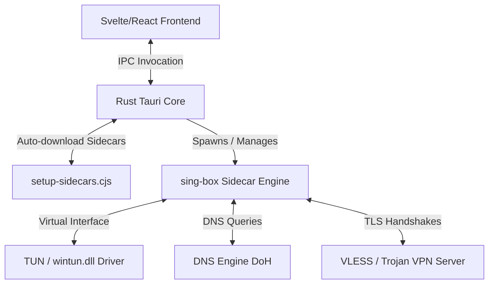

# 🚀 X-Link Desktop Proxy Client

<div align="center">

[](https://github.com/Isuruzenith/X-Link/actions/workflows)
[](https://github.com/google-github-actions/release-please-action)
[](https://github.com/Isuruzenith/X-Link)
[](#)
[](LICENSE)

**X-Link** is a premium, high-performance desktop proxy client built with **Tauri v2**, **React**, **TypeScript**, and **Rust**. Powered by a dynamically managed **sing-box** core sidecar, X-Link provides system-wide proxy tunnels (TUN mode), advanced DNS routing, and an elegant glassmorphic dashboard.

[Key Features](#-key-features) • [Architecture](#%EF%B8%8F-architecture) • [Setup](#-development-setup) • [CI/CD Pipeline](#-cicd-release-pipeline) • [AI Handover](#-ai-handover)

</div>

---

## 🎨 Premium Visual Interface

X-Link features a state-of-the-art interface tailored for usability and aesthetics:
* **Glassmorphic Dashboard**: Sleek semi-transparent panels with dynamic grid layouts.
* **Interactive Traffic Visualizer**: A custom canvas-driven real-time speedometer and traffic graph.
* **Tray-to-Minimize Behavior**: Dynamically changes status icons (Connected 🟢, Connecting 🟡, Disconnected 🔴) with contextual quick-menus in the system tray.

---

## 🚀 Key Features

* **🔌 Multi-Protocol Integration**: Support for VLESS (with TCP Reality & WS), VMess, Trojan, Shadowsocks, SOCKS, and HTTP.
* **🛡️ Virtual TUN Interface**: Establishes system-wide proxy tunnels using `wintun.dll` (Windows) and native `utun`/`tun` adapters (macOS/Linux) with automated elevation helpers.
* **⚡ VLESS ALPN Self-Healing**: Automatically strips `"h2"` from WebSocket outbounds during configuration generation to prevent standard reverse proxies (like Nginx) from dropping handshakes with `EOF`.
* **🔄 5-Stage Connection Self-Healing Loop**:
  1. Default settings (uTLS Chrome fingerprint).
  2. Fallback to uTLS Firefox fingerprint.
  3. Fallback to native Go TLS (disable uTLS).
  4. Fallback to public DNS over HTTPS bootstrap.
  5. Fallback to TUN Compatibility profile, rolling back automatically to System Proxy mode on total failure.
* **⚙️ Advanced Routing & DNS**: Direct detours for local LAN, DNS hijacking, and secure DNS-over-HTTPS (DoH) resolution inside the tunnel with FakeIP capability.

---

## ⚙️ Architecture

X-Link coordinates frontend inputs, Rust platform bindings, and the `sing-box` sidecar execution engine:



---

## 🛠️ Technology Stack

* **Frontend**: React 19, TypeScript, Vite, CSS (Custom Design System with Glassmorphic Elements)
* **Backend**: Rust, Tauri v2 (IPC commands, System Proxy registry, OS bindings)
* **Core Engine**: `sing-box` (v1.11.0 as a dynamically downloaded sidecar process)
* **TUN Driver**: `wintun.dll` (dynamically downloaded/copied for Windows virtual interfaces)

---

## 📁 Directory Structure

```text
X-Link/
├── .github/workflows/   # CI/CD workflows (release-please & tauri-build)
├── scripts/             # CommonJS pre-build setup utilities
│   └── setup-sidecars.cjs # Cross-platform sidecar auto-downloader
├── src/                 # React Frontend application
│   ├── components/      # UI elements & settings panels
│   └── App.tsx          # Main entry component & state orchestration
├── src-tauri/           # Rust Backend
│   ├── src/             # Core Rust modules
│   │   ├── commands/    # Tauri commands (system, config, proxy, latency pings)
│   │   └── config/      # Config generator & raw URI parsers (adapters)
│   └── tauri.conf.json  # Tauri app capability and bundle configurations
```

---

## 💻 Development Setup

### Prerequisites
* **Node.js** (v20+ recommended)
* **Rust & Cargo** (Stable toolchain)
* **Windows C++ Build Tools** (For Windows builds)

### Quick Start
1. **Clone the repository**:
   ```bash
   git clone https://github.com/Isuruzenith/X-Link.git
   cd X-Link
   ```

2. **Install dependencies**:
   ```bash
   npm install
   ```

3. **Run the Development Server**:
   ```bash
   npm run tauri dev
   ```
   *Note: On launch, the pre-build script will automatically download the correct version of `sing-box` (and `wintun.dll` if on Windows) and place it in the `src-tauri/binaries/` directory. These binaries are ignored by Git.*

---

## 🤖 CI/CD Release Pipeline

We use a fully automated release pipeline powered by Google's **Release Please** and a cross-platform Tauri build matrix:

1. **Commit Guidelines**: Write commits following the [Conventional Commits](https://www.conventionalcommits.org/) specification (e.g. `feat: ...`, `fix: ...`).
2. **Release PR**: Upon push to `main`, Release Please creates/updates a Release PR. It automatically bumps version numbers in `package.json` and `src-tauri/tauri.conf.json` and compiles a changelog.
3. **Automated Publish**: When the Release PR is merged:
   - Release Please publishes the release tag (e.g. `v0.1.0`).
   - The same pipeline spawns cross-platform runners (`windows-latest`, `macos-latest`, `ubuntu-22.04`) in parallel.
   - It builds installer files (`.msi` / `.exe` for Windows, `.dmg` / `.app` for macOS, `.deb` / `.AppImage` for Linux) and uploads them directly to the published Release.

---

## 📖 AI Handover

For AI coding agents working on this repository, please review [AI_HANDOVER.md](AI_HANDOVER.md) in the root folder before making changes. It documents critical VLESS WebSocket ALPN restrictions, routing loop exclusions, FakeIP DNS optimizations, and connection fallback steps.

---

## 📄 License

This project is licensed under the MIT License. See [LICENSE](LICENSE) for details.
