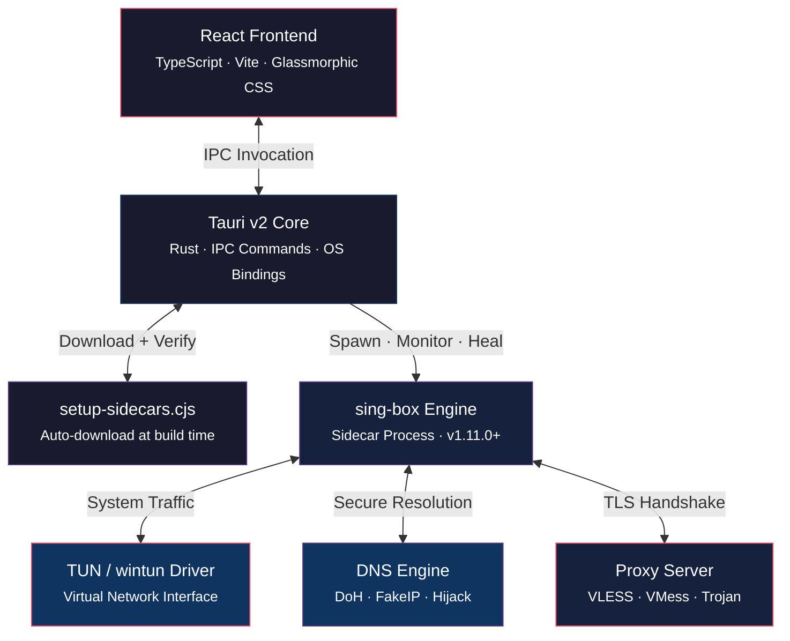
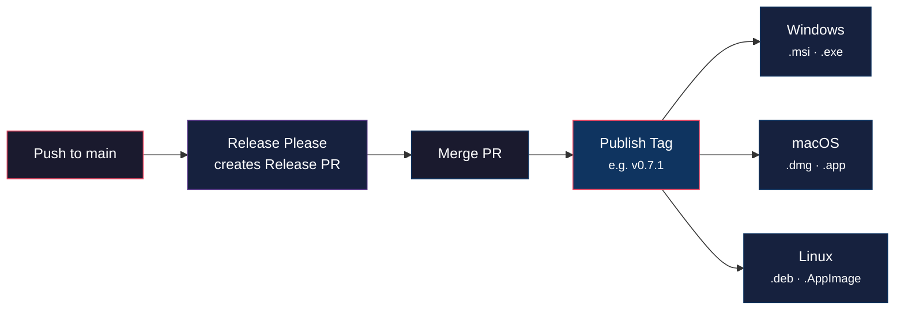

<div align="center">


# X-Link

**Next-Generation Desktop Proxy Client**

A premium, cross-platform proxy client built with **Tauri v2**, **React 19**, and **Rust**.
Powered by a self-managing **sing-box** core with system-wide TUN tunnels, intelligent connection recovery, and a glassmorphic interface.

[](https://github.com/Isuruzenith/X-Link/actions/workflows)
[](https://github.com/Isuruzenith/X-Link/releases/latest)
[](LICENSE)
[](#-installation)
[](CONTRIBUTING.md)
[](CODE_OF_CONDUCT.md)

---

[Features](#-features) · [Architecture](#-architecture) · [Getting Started](#-getting-started) · [Contributing](#-contributing) · [License](#-license)

</div>

<br />

## ✨ Features

<table>
<tr>
<td width="50%">

### 🔌 Multi-Protocol Engine
Connect through **VLESS** (TCP Reality & WebSocket), **VMess**, **Trojan**, **Shadowsocks**, **SOCKS5**, and **HTTP** — all from a single unified interface.

### 🛡️ System-Wide TUN Mode
Creates a virtual network interface (`wintun` on Windows, native `utun`/`tun` on macOS/Linux) for true system-wide traffic capture with automated privilege elevation.

### ⚡ ALPN Self-Healing
Automatically strips `h2` from WebSocket outbounds at config generation time, preventing silent `EOF` failures when connecting through standard reverse proxies.

</td>
<td width="50%">

### 🔄 5-Stage Connection Recovery
Never get stuck on "Connecting..." — X-Link automatically cycles through 5 progressively permissive TLS/DNS strategies before gracefully falling back to System Proxy mode.

### 🌐 FakeIP DNS
Zero-latency domain resolution using synthetic IPs from a reserved range (`198.18.0.0/15`), with automatic bypass for local network domains.

### 🎨 Glassmorphic Dashboard
Real-time traffic visualization with canvas-driven speedometers, live connection logs, and adaptive system tray icons (🟢 🟡 🔴) with contextual quick-menus.

</td>
</tr>
</table>

<br />

<details>
<summary><strong>🔄 Connection Recovery — How It Works</strong></summary>
<br />

When a connection attempt fails, X-Link doesn't just retry — it systematically adjusts its strategy:

| Stage | Strategy | What Changes |
|:-----:|----------|--------------|
| 1 | **Chrome uTLS** | Default config — Chrome TLS fingerprint |
| 2 | **Firefox uTLS** | Switches TLS fingerprint to Firefox |
| 3 | **Native TLS** | Disables uTLS fingerprinting entirely |
| 4 | **DNS Bootstrap** | Routes proxy DNS through `1.1.1.1` / `8.8.8.8` direct |
| 5 | **TUN Compatibility** | Relaxes strict routing and interface settings |
| ⤵️ | **System Proxy Rollback** | If all TUN attempts fail, regenerates config for system proxy mode |

</details>

<br />

## 🏗 Architecture



### Tech Stack

| Layer | Technologies |
|-------|-------------|
| **Frontend** | React 19 · TypeScript · Vite 8 · Custom Glassmorphic CSS Design System |
| **Backend** | Rust · Tauri v2 · System Proxy Registry · Platform OS Bindings |
| **Core Engine** | sing-box (dynamically downloaded sidecar) |
| **TUN Driver** | wintun.dll (Windows) · utun (macOS) · tun (Linux) |

<br />

## 📁 Project Structure

```text
X-Link/
├── .github/
│   ├── ISSUE_TEMPLATE/       # Bug report & feature request templates
│   ├── pull_request_template.md
│   └── workflows/            # CI/CD (release-please & tauri-build)
│
├── scripts/
│   └── setup-sidecars.cjs    # Cross-platform sidecar auto-downloader
│
├── src/                      # React Frontend
│   ├── assets/               # Logo & static assets
│   ├── components/           # Reusable UI components
│   │   ├── TrafficChart.tsx   # Canvas-driven real-time traffic graph
│   │   ├── NavRail.tsx        # Navigation sidebar
│   │   └── domain/           # Domain-specific components
│   ├── views/                # Page-level views
│   │   ├── DashboardView     # Main dashboard with speedometer
│   │   ├── ConfigView        # Protocol configuration
│   │   ├── ConnectionsView   # Active connection monitor
│   │   ├── RoutingView       # Custom routing rules
│   │   ├── LogsView          # Real-time log viewer
│   │   └── SettingsView      # App & TUN settings
│   └── stores/               # Zustand state management
│
├── src-tauri/                # Rust Backend
│   ├── src/
│   │   ├── commands/         # Tauri IPC commands
│   │   │   ├── proxy.rs      # Connection lifecycle & self-healing
│   │   │   └── latency.rs    # Latency pinging with DoH bypass
│   │   ├── config/
│   │   │   ├── generator.rs  # sing-box JSON config builder
│   │   │   ├── adapters/     # URI parsers (vless://, vmess://, etc.)
│   │   │   └── mod.rs        # Route exclusions & network detection
│   │   └── state.rs          # Global app state & defaults
│   └── tauri.conf.json       # Tauri capabilities & bundle config
│
├── AI_HANDOVER.md            # Architectural rules for developers & AI agents
├── CONTRIBUTING.md           # Contribution guidelines
├── CODE_OF_CONDUCT.md        # Contributor Covenant v2.1
├── SECURITY.md               # Vulnerability reporting policy
└── LICENSE                   # MIT License
```

<br />

## 🚀 Getting Started

### Prerequisites

| Tool | Version | Install |
|------|---------|---------|
| **Node.js** | v22+ | [nodejs.org](https://nodejs.org/) |
| **Rust** | Stable (latest) | [rustup.rs](https://rustup.rs/) |
| **C++ Build Tools** | — | Windows only — [Visual Studio Build Tools](https://visualstudio.microsoft.com/visual-cpp-build-tools/) |

### Quick Start

```bash
# 1. Clone
git clone https://github.com/Isuruzenith/X-Link.git
cd X-Link

# 2. Install dependencies
npm install

# 3. Launch development mode
npm run tauri dev
```

> **📦 Automatic Sidecar Setup** — On first launch, the pre-build script downloads the correct `sing-box` binary (and `wintun.dll` on Windows) into `src-tauri/binaries/`. These files are git-ignored and never committed.

<br />

## 🤝 Contributing

We welcome contributions of all kinds! Here's how to get involved:

| Resource | Description |
|----------|-------------|
| 📖 [Contributing Guide](CONTRIBUTING.md) | Development setup, code standards, and PR process |
| 📜 [Code of Conduct](CODE_OF_CONDUCT.md) | Expected community behavior (Contributor Covenant v2.1) |
| 🔒 [Security Policy](SECURITY.md) | How to report vulnerabilities privately |
| 🤖 [AI Handover](AI_HANDOVER.md) | Architectural invariants for AI agents and new developers |

### Commit Convention

This project uses [Conventional Commits](https://www.conventionalcommits.org/) with automated versioning via [Release Please](https://github.com/google-github-actions/release-please-action):

```
feat: add Shadowsocks protocol support     → minor version bump
fix: prevent ALPN h2 in WebSocket outbounds → patch version bump
feat!: redesign config schema               → major version bump
```

<br />

## 🤖 CI/CD Pipeline

Fully automated cross-platform releases powered by **Release Please** and **GitHub Actions**:



<br />

## 📄 License

This project is licensed under the **MIT License** — Copyright © 2026 [Isuruzenith](https://github.com/Isuruzenith).

See [LICENSE](LICENSE) for the full text.

---

<div align="center">

**Built with ❤️ using [Tauri](https://tauri.app/) · [React](https://react.dev/) · [Rust](https://www.rust-lang.org/) · [sing-box](https://sing-box.sagernet.org/)**

</div>
